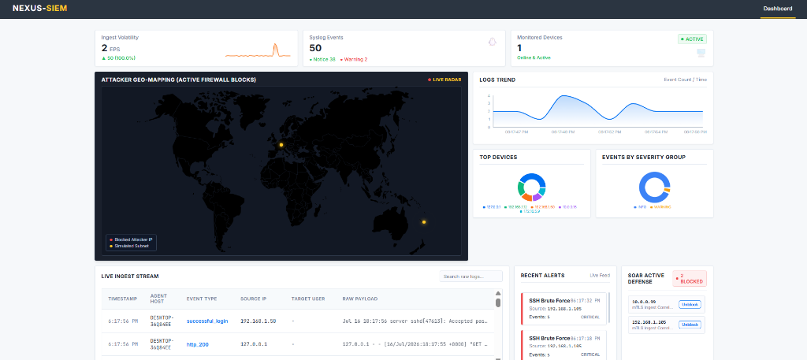

# NEXUS-SIEM & SOAR Security Framework

   

A secure, high-performance, and decentralized Security Information and Event Management (SIEM) and Security Orchestration, Automation, and Response (SOAR) sandbox environment. This framework features a multi-threaded endpoint shipper agent, a secure mTLS ingestion pipeline, an asynchronous WAL-mode database queue, a behavioral correlation engine, and a real-time SOC dashboard.

### Unified React SOC Dashboard (Single-Screen Layout)


---

##  Project Abstract & Problem Statement

In modern enterprise networks, centralized log collection faces three major bottlenecks:
1. **Security in Transit**: Attackers can intercept or spoof log payloads sent by endpoints if log shipping channels are unencrypted and unauthenticated.
2. **Database Ingestion Bottlenecks**: High-throughput log collection (thousands of events per second) causes database locking collisions and packet loss in standard relational storage engines.
3. **Delayed Incident Response**: Security analysts are overwhelmed by alerts, leading to delayed manual responses to active attacks (like SSH brute forcing).

### Project Objectives:
* **Securing Log Pipelines**: Implement a strict **Mutual TLS (mTLS)** validation system where logs are encrypted and only authorized shipper agents holding valid PKI certificates signed by a private Root CA can ingest logs.
* **Scaling Relational Storage**: Tune SQLite using **Write-Ahead Logging (WAL)** and an **asynchronous worker thread-queue** to serialize insertions, preventing database lock crashes.
* **Automating Incident Mitigation (SOAR)**: Integrate an automated correlation rules engine that correlates events in real-time and immediately triggers a firewall blocklist to isolate malicious IP addresses.
* **Real-time Visual Analytics**: Build a unified SOC Operations Center using React WebSockets to track live Flow Rates (EPS), device status, and incident feeds.

---

##  System Architecture

The framework consists of five core components working in a decoupled, multi-process environment:

```
[Target Endpoint]                   [SIEM Backend Server]                 [SOC Operator]
+------------------+  mTLS Ingest   +-------------------+  WebSockets/    +---------------+
| Shipper Agent    | -------------> | Ingestion API     |  HTTPS          | React SOC     |
| (Multi-Threaded) | (Port 5001)    | (Flask Thread 1)  | --------------> | Dashboard UI  |
+------------------+                +-------------------+                 | (Port 5173)   |
                                              |                           +---------------+
                                    +-------------------+                         |
                                    | Rules Correlation |                         | Manual
                                    | (Engine Core)     |                         | Unblock
                                    +-------------------+                         | API
                                              |                                   v
                                    +-------------------+  SOAR Blocker   +---------------+
                                    | Async DB Queue    | --------------> | Firewall List |
                                    | (WAL Storage)     |                 | (blocked_ips) |
                                    +-------------------+                 +---------------+
```

1. **Lightweight Shipper Agent (`agent/`)**: Spawned in independent background threads to tail system log files (`auth.log`, `web.log`) and forward entries securely using client certificates.
2. **Central Ingestion & mTLS Receiver (`backend/run.py` - Port 5001)**: Enforces client certificate validation against the private CA during the TLS handshake, guaranteeing sender authentication.
3. **Database Scaling Engine (`backend/app/database/`)**: Processes writes asynchronously through a thread-safe Queue worker, preventing write blocks.
4. **Behavioral Correlation Rules (`backend/app/rules/`)**: Evaluates logs in real-time using a dynamic YAML ruleset, tracking malicious actions inside memory sliding windows.
5. **Interactive SOAR Blocker (`backend/app/soar/`)**: Automatically appends compromised IPs to a blocklist registry, exposing REST API endpoints to read or release blocked IPs.

---

##  Project Directory Structure

```
nexus-siem/
│
├── agent/                  # Endpoint log shipping service
│   ├── config.json         # Targets log files & ports
│   ├── main.py             # Multi-threaded shipper daemon
│   └── utils/
│       └── file_watcher.py # Follows log files in unbuffered mode
│
├── backend/                # SIEM Server Core
│   ├── app/
│   │   ├── main.py         # Flask app APIs setup
│   │   ├── api/            # Logs, alerts, and SOAR controllers
│   │   ├── core/           # Parser & Correlation engines
│   │   ├── database/       # WAL storage & async queue client
│   │   ├── rules/          # Correlation configs (YAML)
│   │   └── soar/           # Firewall blocker database
│   ├── certs/              # (Generated) TLS Root CA, Server & Client certs
│   ├── run.py              # Server runner (Port 5000 & Port 5001)
│   └── requirements.txt
│
├── frontend/               # React Security Operations Center UI
│   ├── src/
│   │   ├── components/     # Trend charts, tables, alert panels
│   │   ├── App.jsx         # Dashboard state & websocket handlers
│   │   └── index.css       # Enterprise layout styling
│   └── package.json
│
├── attacks_sim/            # Network attack simulators
│   ├── normal_traffic_sim.py
│   ├── brute_force_sim.py
│   └── dir_bust_sim.py     # Directory busting web attack simulator
│
└── scripts/
    └── generate_certs.py   # PKI Certificate Authority generator
```

---

##  Tech Stack & Dependencies

* **Frontend**: React 18, Recharts (SVG visualization charts), Socket.io-client, CSS Grid.
* **Backend**: Python 3, Flask, Flask-SocketIO (WebSockets), Flask-CORS.
* **Security & PKI**: Cryptography (Python library for X509 certs generation), Python `ssl` library.
* **Database**: SQLite (tuned in WAL mode for concurrent operations).

---

##  Installation & Deployment Instructions

Ensure Python 3 and Node.js are installed on your host system. Open separate terminals for each step:

### Step 1: Generate PKI Certificates
Build the CA key, server TLS certs, and client TLS certs required for mTLS encryption:
```bash
python scripts/generate_certs.py
```
This generates `ca.crt`, `server.crt`, `server.key`, `client.crt`, and `client.key` in the `certs/` folder.

### Step 2: Boot the SIEM Backend Server
Navigate to the `backend/` directory, install packages, and start the dual-port server:
```bash
cd backend
pip install -r requirements.txt
python run.py
```
* **Dashboard HTTP API**: `http://localhost:5000`
* **Log Ingest Secure API**: `https://localhost:5001` (Strict Client mTLS)

### Step 3: Run the React SOC Dashboard
Navigate to the `frontend/` directory, install assets, and start the development server:
```bash
cd frontend
npm install
npm run dev
```
* Open `http://localhost:5173/` in your browser.

### Step 4: Run the Endpoint Log Shipper
Navigate to the `agent/` directory and run the shipping daemon. It will automatically load the client certificates and verify the server's identity using mTLS:
```bash
cd agent
pip install -r requirements.txt
python main.py
```

### Step 5: Simulate Traffic & Attacks
To feed log events into the SIEM and test the automated SOAR blocker:
* **To generate background traffic** (simulates cron jobs, logins, and web visits):
  ```bash
  cd attacks_sim
  python normal_traffic_sim.py
  ```
* **To launch an SSH Brute Force Attack** (triggers alerts and automated firewall blocklist):
  ```bash
  cd attacks_sim
  python brute_force_sim.py
  ```
  Watch the attacking IP address appear in the **SOAR Active Defense** widget on the React dashboard. Click **Unblock** to manually lift the blocklist rule.
* **To launch a Directory Busting Web Attack** (triggers directory busting alerts):
  ```bash
  cd attacks_sim
  python dir_bust_sim.py
  ```


---

## 📊 Advanced Visual Analytics & SOC Layout

The React SOC dashboard has been visually optimized into a high-density, **single-screen above-the-fold layout** designed to give security analysts immediate visibility into system health and threats without needing to scroll.

### Key Visual Components:
1. **Real-time Ingest Volatility (EPS Sparkline)**:
   * Triggers a WebSocket update on every incoming log.
   * Tracks and renders the rolling events-per-second (EPS) flow rate using a sleek Recharts area sparkline.
2. **Events by Severity Group (Donut Chart)**:
   * Categorizes incoming log severity dynamically into **INFO** (blue), **WARNING** (orange), and **CRITICAL** (red) groups.
3. **Attacker Geo-Mapping (Robinson Threat Map)**:
   * Renders active firewall blocks on a high-tech cybersecurity world map.
   * Uses a custom mathematical **Robinson projection** in JavaScript to map attacker coordinates dynamically.
   * Features glowing, pulsing threat pins with **interactive hover tooltips** displaying details of the compromise (IP, country, city, rule violated, and block time).
4. **Log Stream with Sticky Headers**:
   * Logs flow in real-time inside a scroll-locked container (`max-height: 195px`).
   * Column headers remain **pinned/sticky** during active scrolling to maintain contextual visibility.

### Shipping Agent Optimizations:
* **0-Second Windows DNS Lookup Latency Fix**: Resolved a performance bug where Python's `requests` library took 2 seconds attempting to resolve the `localhost` ingestion URL via IPv6 on Windows before falling back to IPv4 (`127.0.0.1`). Updating the host to `127.0.0.1` dropped transport latency to **exactly 0 seconds**.
* **Sliding Correlation Windows**: Configured 60-second sliding windows for brute-force and directory-busting detection rules to match realistic queue-processing delays.
